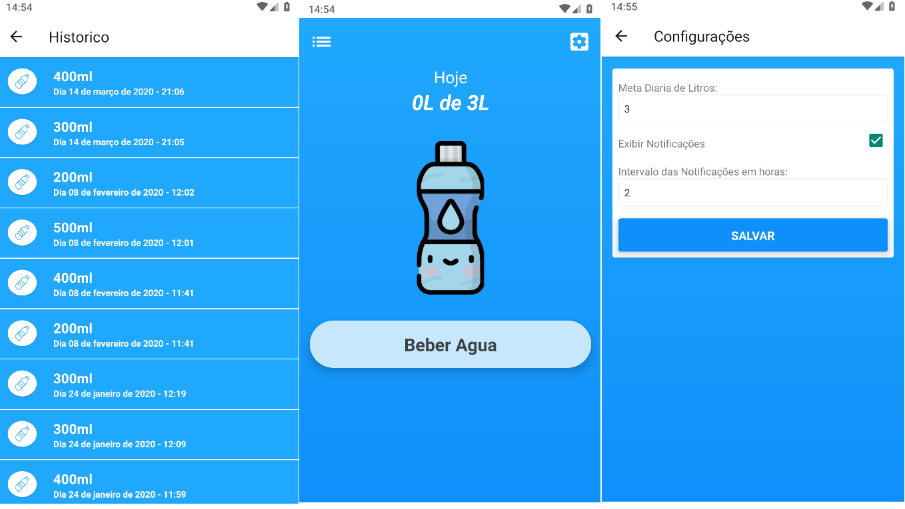

<h1 align="center">Drink Water</h1>


### :page_with_curl: About
Aplicativo para registrar a quantidade de agua tomada durante do dia.

O principal objetivo do aplicativo foi aprender como funciona o Realm no react native e a publicação na Google play usando code push e appcenter.

Baixe ele na <a href="https://play.google.com/store/apps/details?id=dev.julianosirtori.drinkwaterreminder"> Google Play</a>



### :rocket: Running Locally


```sh
# 1.
yarn

# 2.
react-native run-android

# 3.
yarn start

```


---

<p align="center">
Made with ♥ by <a href="https://www.linkedin.com/in/juliano-sirtori">Juliano</a>
</p>